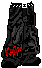

# Dollz Cheatsheet - goth

Wings · Bodies & Legs · Dresses & Skirts · Trousers · Bodies · Tops · Heads · Accessories

## Wings

2 png(s): pw1 · pa6

  

## Bodies & Legs

13 png(s): pb1 · pb2 · pb3 · pb4 · ps11 · ps12 · pb6 · pb7 · pb8 · pb9 · pb10 · pb11 · pb12

             

## Dresses & Skirts

21 png(s): ps1 · ps2 · ps4 · ps5 · ps6 · ps7 · ps13 · ps14 · ps15 · ps16 · ps17 · ps8 · ps9 · ps10 · pd1 · pd2 · pd3 · pd4 · pd5 · pd6 · pd7

                     

## Trousers

19 png(s): pp1 · pp2 · pp3 · pp4 · pp5 · pp6 · pp7 · pp8 · pp9 · pp10 · pp11 · pp12 · pp13 · pp14 · pp15 · pp16 · pp17 · pp18 · pp19

                   

## Bodies

12 png(s): pj1 · pj2 · pj3 · pj4 · pj5 · pj6 · pj7 · pj8 · pj10 · pj9 · pj11 · pb5

            

## Tops

39 png(s): pt1 · pt2 · pt3 · pt4 · pt5 · pt6 · pt7 · pt8 · pt10 · pt11 · pt12 · pt13 · pt14 · pt15 · pt16 · pt17 · pt18 · pt19 · pt20 · pt21 · pt22 · pt23 · pt24 · pt25 · pt26 · pt27 · pt28 · pt29 · pt30 · pt31 · pt32 · pt33 · pt34 · pt35 · pt36 · pt37 · pt38 · pt39 · pt40

                                       

## Heads

40 png(s): ph1 · ph2 · ph3 · ph4 · ph5 · ph6 · ph7 · ph8 · ph9 · ph10 · ph11 · ph12 · ph13 · ph14 · ph15 · ph16 · ph17 · ph19 · ph20 · ph21 · ph22 · ph23 · ph24 · ph25 · ph26 · ph27 · ph28 · ph29 · ph30 · ph31 · ph32 · ph33 · ph34 · ph35 · ph36 · ph37 · ph38 · ph39 · ph40 · ph41

                                        

## Accessories

5 png(s): pa1 · pa2 · pa3 · pa4 · pa5

     

