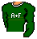
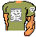
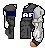
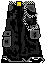

# Dollz Cheatsheet - maleprep

Heads · Bodies · Tops · Pants

## Heads

44 png(s): mh1 · mh2 · mh4 · mh5 · mh6 · mh7 · mh8 · mh9 · mh10 · mh11 · mh12 · mh13 · mh14 · mh15 · mh16 · mh17 · mh18 · mh19 · mh20 · mh21 · mh22 · mh23 · mh25 · mh24 · mh27 · mh28 · mh29 · mh30 · mh31 · mh32 · mh33 · mh34 · mh35 · mh36 · mh37 · mh38 · mh39 · mh40 · mh41 · mh42 · mh43 · mh44 · mh45 · mh46

                                            

## Bodies

5 png(s): mb1 · mb2 · mb3 · mb4 · mb5

     

## Tops

61 png(s): mt1 · mt2 · mt3 · mt4 · mt5 · mt6 · mt7 · mt8 · mt9 · mt11 · mt13 · mt14 · mt16 · mt17 · mt18 · mt19 · mt21 · mt23 · mt24 · mt25 · mt26 · mt27 · mt28 · mt29 · mt30 · mt32 · mt33 · mt34 · mt35 · mt36 · mt37 · mt39 · mt40 · mt41 · mt46 · mt48 · mt49 · mt50 · mt51 · mt52 · mt53 · mt54 · mt55 · mt56 · mt57 · mt58 · mt59 · mt60 · mt61 · mt31 · mt47 · mt15 · mt12 · mt10 · mt20 · mt22 · mt38 · mt43 · mt44 · mt45 · mt42

                                                             

## Pants

37 png(s): mp1 · mp2 · mp3 · mp4 · mp5 · mp6 · mp7 · mp8 · mp9 · mp10 · mp11 · mp12 · mp13 · mp14 · mp15 · mp16 · mp17 · mp18 · mp19 · mp20 · mp21 · mp22 · mp23 · mp24 · mp25 · mp26 · mp27 · mp28 · mp29 · mp30 · mp31 · mp32 · mp33 · mp34 · mp35 · mp36 · mp37

                                     

