# Cheatsheet Dollz in ./no1

## /bikiniprops

92 png(s): ba1 · ba10 · ba11 · ba12 · ba13 · ba14 · ba15 · ba16 · ba17 · ba18 · ba19 · ba2 · ba20 · ba21 · ba22 · ba23 · ba24 · ba3 · ba4 · ba5 · ba6 · ba7 · ba8 · ba9 · bb1 · bb10 · bb11 · bb12 · bb13 · bb14 · bb15 · bb16 · bb17 · bb18 · bb19 · bb2 · bb20 · bb21 · bb22 · bb23 · bb3 · bb4 · bb5 · bb6 · bb7 · bb8 · bb9 · bl1 · bl10 · bl11 · bl12 · bl13 · bl14 · bl15 · bl17 · bl18 · bl19 · bl2 · bl20 · bl21 · bl22 · bl23 · bl3 · bl4 · bl5 · bl6 · bl7 · bl8 · bl9 · bt1 · bt10 · bt11 · bt12 · bt13 · bt14 · bt15 · bt16 · bt17 · bt18 · bt19 · bt2 · bt20 · bt21 · bt22 · bt23 · bt3 · bt4 · bt5 · bt6 · bt7 · bt8 · bt9

                                                                                            

## /maleprepprops

147 png(s): mb1 · mb2 · mb3 · mb4 · mb5 · mh1 · mh10 · mh11 · mh12 · mh13 · mh14 · mh15 · mh16 · mh17 · mh18 · mh19 · mh2 · mh20 · mh21 · mh22 · mh23 · mh24 · mh25 · mh27 · mh28 · mh29 · mh30 · mh31 · mh32 · mh33 · mh34 · mh35 · mh36 · mh37 · mh38 · mh39 · mh4 · mh40 · mh41 · mh42 · mh43 · mh44 · mh45 · mh46 · mh5 · mh6 · mh7 · mh8 · mh9 · mp1 · mp10 · mp11 · mp12 · mp13 · mp14 · mp15 · mp16 · mp17 · mp18 · mp19 · mp2 · mp20 · mp21 · mp22 · mp23 · mp24 · mp25 · mp26 · mp27 · mp28 · mp29 · mp3 · mp30 · mp31 · mp32 · mp33 · mp34 · mp35 · mp36 · mp37 · mp4 · mp5 · mp6 · mp7 · mp8 · mp9 · mt1 · mt10 · mt11 · mt12 · mt13 · mt14 · mt15 · mt16 · mt17 · mt18 · mt19 · mt2 · mt20 · mt21 · mt22 · mt23 · mt24 · mt25 · mt26 · mt27 · mt28 · mt29 · mt3 · mt30 · mt31 · mt32 · mt33 · mt34 · mt35 · mt36 · mt37 · mt38 · mt39 · mt4 · mt40 · mt41 · mt42 · mt43 · mt44 · mt45 · mt46 · mt47 · mt48 · mt49 · mt5 · mt50 · mt51 · mt52 · mt53 · mt54 · mt55 · mt56 · mt57 · mt58 · mt59 · mt6 · mt60 · mt61 · mt7 · mt8 · mt9

                                                                                                                                                   

## /prepadidasprops

71 png(s): pp1 · pp10 · pp11 · pp12 · pp13 · pp14 · pp15 · pp16 · pp17 · pp18 · pp19 · pp2 · pp20 · pp21 · pp22 · pp23 · pp24 · pp3 · pp4 · pp5 · pp6 · pp7 · pp8 · pp9 · pt1 · pt10 · pt11 · pt12 · pt13 · pt14 · pt15 · pt16 · pt17 · pt18 · pt19 · pt2 · pt20 · pt21 · pt23 · pt24 · pt25 · pt26 · pt27 · pt28 · pt29 · pt3 · pt30 · pt31 · pt32 · pt33 · pt34 · pt35 · pt36 · pt37 · pt38 · pt39 · pt4 · pt40 · pt41 · pt42 · pt43 · pt44 · pt45 · pt46 · pt47 · pt48 · pt5 · pt6 · pt7 · pt8 · pt9

  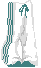                                                                     

## /prepgothprops

151 png(s): pa1 · pa2 · pa3 · pa4 · pa5 · pa6 · pb1 · pb10 · pb11 · pb12 · pb2 · pb3 · pb4 · pb5 · pb6 · pb7 · pb8 · pb9 · pd1 · pd2 · pd3 · pd4 · pd5 · pd6 · pd7 · ph1 · ph10 · ph11 · ph12 · ph13 · ph14 · ph15 · ph16 · ph17 · ph19 · ph2 · ph20 · ph21 · ph22 · ph23 · ph24 · ph25 · ph26 · ph27 · ph28 · ph29 · ph3 · ph30 · ph31 · ph32 · ph33 · ph34 · ph35 · ph36 · ph37 · ph38 · ph39 · ph4 · ph40 · ph41 · ph5 · ph6 · ph7 · ph8 · ph9 · pj1 · pj10 · pj11 · pj2 · pj3 · pj4 · pj5 · pj6 · pj7 · pj8 · pj9 · pp1 · pp10 · pp11 · pp12 · pp13 · pp14 · pp15 · pp16 · pp17 · pp18 · pp19 · pp2 · pp3 · pp4 · pp5 · pp6 · pp7 · pp8 · pp9 · ps1 · ps10 · ps11 · ps12 · ps13 · ps14 · ps15 · ps16 · ps17 · ps2 · ps4 · ps5 · ps6 · ps7 · ps8 · ps9 · pt1 · pt10 · pt11 · pt12 · pt13 · pt14 · pt15 · pt16 · pt17 · pt18 · pt19 · pt2 · pt20 · pt21 · pt22 · pt23 · pt24 · pt25 · pt26 · pt27 · pt28 · pt29 · pt3 · pt30 · pt31 · pt32 · pt33 · pt34 · pt35 · pt36 · pt37 · pt38 · pt39 · pt4 · pt40 · pt5 · pt6 · pt7 · pt8 · pw1

   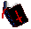        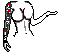    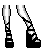     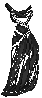   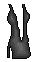                            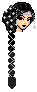                       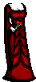  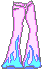  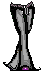         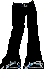   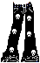 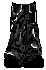         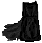 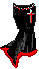       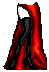    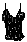          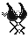      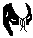          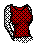 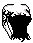 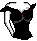 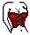          

## /prepprops

193 png(s): apartedame · b1 · beige_truitje_met_hartje · beigebroek · benenrok · blackgurl5 · blackgurlstaartjahs · blauweigebroek · bloek1 · bloek2 · bloek3 · bloek4 · bloek5 · bloek6 · bloemebroekook · bloessie · blond135 · blond167 · blond181 · blond2 · blonde3 · blonde4 · blondeglasses · blondehoeriesloeriehoofd · blondjerules · body2 · brillieeop · britneytruitje · britneytruitje2 · broekbroekskoek · broekk · broekkapot · broekmetflittah · broekmetriem · broekoranjuhhh · broekriemm · broekroodriem · broekroze · broekslingers · brownbodiej · brownboyd · brownhair3 · brownhair4 · brownhair5 · brownhead1 · brownhead2 · brownhead3 · brownpantsset1[1] · bruinhaaar · bruinhaarmeisjah · bruinhaarmiessie · bruintruitje · catsuit · cherrylicious · diekentiedereen · ditiseenbroek · dress022 · dressbluedaisies · flowah_rok · fp1 · fp10 · fp11 · fp12 · fp13 · fp14 · fp15 · fp16 · fp17 · fp2 · fp3 · fp4 · fp5 · fp6 · fp7 · fp8 · fp9 · ft1 · ft10 · ft11 · ft12 · ft13 · ft14 · ft15 · ft16 · ft17 · ft18 · ft19 · ft2 · ft20 · ft21 · ft22 · ft23 · ft24 · ft25 · ft26 · ft27 · ft3 · ft4 · ft5 · ft6 · ft7 · ft8 · ft9 · gekkeglitterbroek · haarbruin · haarmeisjebruin · hartjahuhs · head038 · head135 · head137 · hoofdhaaar · hoofdrozehaar · hoofdzwarthaar · hooft1 · hooft2 · hooft3 · ikbeneenhoer · jassieh · julk1 · julk2 · jurkja · jurkjeh · jurkoranje · jurkpaars · jurkvrouw · justkja · kakker1 · kakker2 · kakker3 · langzwarthaar · leukleintruitje · lok1 · lok2 · magicaldress · meisjemeteenhoofd · mooibloessieman · mooiejurklijf · moojurkjesetje · negerlijfah · netprinesjurk · oranjeboven · oranjebroek · p1 · p2 · readhair3 · redhair1 · regenboogbroek · rokbenenschoenen · rokje_rood_beige · rokjuh · rokmetgaten · rokmooi · roodmetding · roodtruitjah · roodtruitje · roze_glitter_jurk · rozehaar · rozetruitje · schoudertruitjah · schoudertruitjewit · soortbloes · steelosetje · streepbroek · t1 · t10 · t11 · t12 · t14 · t2 · t3 · t4 · t5 · t6 · t7 · t8 · t9 · tluitje1 · tluitje2 · tluitje3 · topje_rood_beige · tralalatrui · truitjah · truitje_kleurtjes · truitjekleurtjes · truitjemetrozeenzo · truitjeroodig · truitjuh_paarsig · truitjuhszz · usamenshoofd · weed_rok · whitebody2 · zwartglitterbroek · zwarttruitje

                                                                                                                                                                                                 

